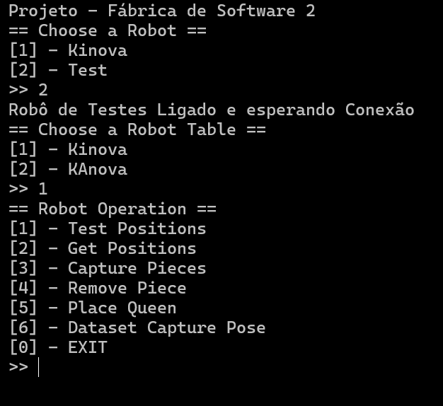
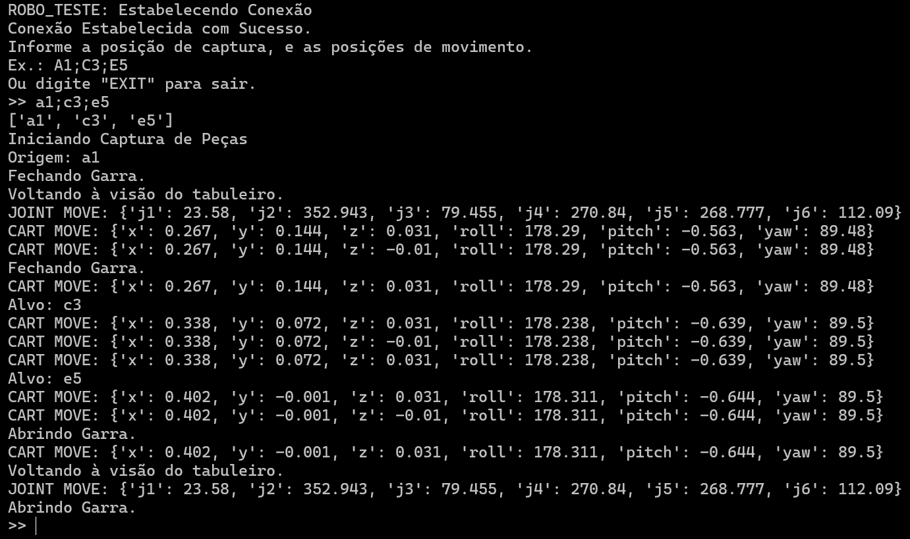
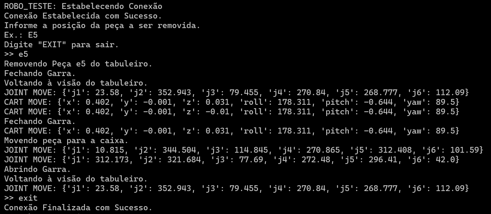
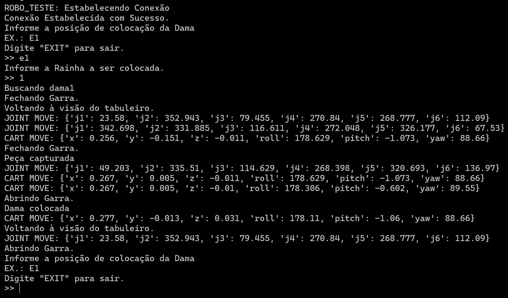
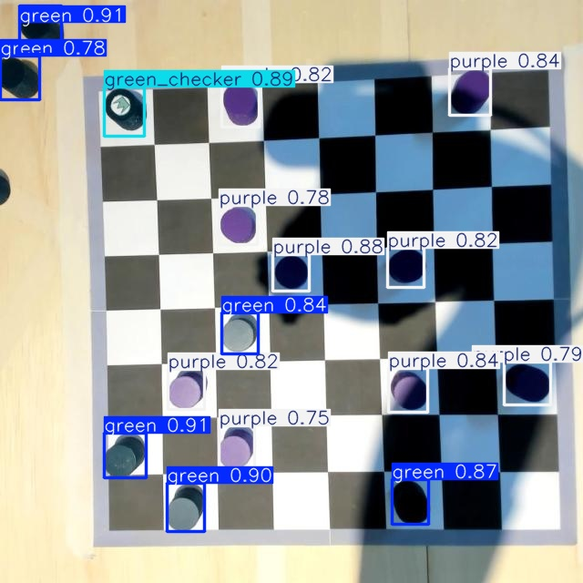

# Fábrica de Software 2 - GRUPO 3 - Backend
Repositório do Back-End do projeto de avaliação da Fábrica de Software 2 - GRUPO 3

## Executando o projeto:
O projeto foi desenvolvido utilizando **Flask** e o **RRIA** para controle e comunicação com o robô. Para isso, precisa de algumas configurações específicas para garantir a execução correta e estável.
Para isso, foi incluído um arquivo yaml em `dependencies/environment.yaml` que contém as configurações necessárias para criação de um ambiente virtual **conda** com as dependências necessárias para execução do projeto. Para isso, basta executar o comando:

```powershell
conda env create -f dependencies/environment.yaml
```

Em seguida, ative o ambiente virtual com o comando:

```powershell
conda activate kortex
```

### Atualizando o ambiente
Caso seja necessário atualizar o ambiente, basta executar o comando:

```powershell
conda env update -f dependencies/environment.yaml --prune
```

### Conectando com o Kinova

Para conexão via cabo Ethernet com o Kinova, é necessário configurar o IP do computador para a faixa de IP do robô. Para isso, basta seguir os passos abaixo:
1. Painel de Controle
2. Central de Rede e Compartilhamento
3. Alterar as configurações do adaptador
4. Ethernet Status
5. Ethernet Properties
6. Internet Protocol Version 4 (TCP/IPv4) Properties
7. Usar o seguinte endereço IP:
    - Endereço IP: `192.168.2.11`
    - Máscara de sub-rede: `255.255.255.0`
8. Acesse o front-end via IP `192.168.2.10`.

## Banco de Movimentos:
O banco de movimentos é composto por um arquivo `positions_kinova.json` (com as informações de posições cartesianas e angulares do robô em cada etapa intermediária do movimemento) e um módulo `MoveBank` responsável por traduzir o arquivo json para os tipos de pose e juntas conhecido pelo robô.

### Estrutura do Arquivo `positions_kinova.json`
```json
{
    "nome_posicao": {
        "cartesian": "[x, y, z, roll, pitch, yaw]",
        "joints": "[j1, j2, j3, j4, j5, j6]"
    }
}
```
### Posições Mapeadas:
Foram mapeadas posições de movimentação geral do robô, bem como a posição do **drop** e cada casa jogável do tabuleiro.

| Nome da Posição | Descrição |
| :--- | :--- |
| `capture_height` | Posição de Altura pré-captura das peças. Valores de _x_ e _y_ devem ser obtidos à partir da posição alvo. |
| `home` | Posição inicial do robô antes da operação de jogo. |
| `middle_move_height` | Posição de Altura utilizada entre a movimentação de peças. Valores de _x_ e _y_ devem ser obtidos à partir da posição alvo. |
| `upper_drop_height` | Posição de drop pós captura de peça. |
| `upper_movement_height` | Posição intermediária de Altura utilizada antes de movimentação para drop. |
| `upper_view` | Posição **iddle** utilizada para visualizar o tabuleiro. |
| `safe_shutdown` | Posição pré-desligamento do robô. |
| `pregrip_height` | Posição de movimentação em tabuleiro. Valores de _x_ e _y_ devem ser obtidos à partir da posição alvo. |
| `n0` | Posição no formato `LetraNumero` representando cada casa jogável no tabuleiro. Os valores de _z_ são quase rentes ao tabuleiro, e devem ser combinados com os valores de `capture_height` e `pregrip_height` para movimentações. |
| `dama0c` | Valores de posição das damas no formato `damaNC` onde `N = Numero` e `C = cor`. Valores de _z_ são referentes à posição rente ao tabuleiro. |
| `dama0c_pregrip` | Valores de posição das damas no formato `damaNC_pregrip` onde `N = Numero` e `C = cor`. Valores de _z_ são referentes à altura antes da captura da peça. |

## Entregável Semana 1 - Scripts de Movimentação do Robô
Para executar o projeto, basta executar o arquivo `main.py` com o comando:

```powershell
python .\src\main.py
```

Com isso um menu de escolha do robô será exibido, possibilitando a execução do projeto com o robô de Testes ou o robô Kinova. Basta digitar o número correspondente à escolha e pressionar `Enter`. Em seguida, o menu de escolha da mesa do robô será exibida, possibilitando selecionar entre o Kinova (Mesa da Direita) ou o "KAnova" (Mesa da Esquerda). Basta digitar o número correspondente à escolha e pressionar `Enter`.

O programa fará a instância dos robôs, banco de movimentos e controlador do robô e permitirá a execução das tarefas de:
- Movimentar Peças
- Remover Peças
- Colocar uma Dama no Tabuleiro

> Na versão atual, o controlador do robô executará a conexão e se desconectará em cada uma das opções do menu. Em versões futuras, a conexão será mantida durante a execução do programa.

Na seleção de casas no tabuleiro, a notação `LetraNumero` assume que as letras de `A` a `H` representam as colunas, e os números de `1` a `8` representam as linhas. A posição se inicia em `A1` sendo a casa branca mais à esquerda, próximo ao robô, e a posição `H8` sendo a casa branca mais à direita, mais distante do robô.

|   | H | G | F | E | D | C | B | A |
|---|---|---|---|---|---|---|---|---|
| 1 |   | g1 |   | e1 |   | c1 |   | a1 |
| 2 | h2 |   | f2 |   | d2 |   | b2 |   |
| 3 |   | g3 |   | e3 |   | c3 |   | a3 |
| 4 | h4 |   | f4 |   | d4 |   | b4 |   |
| 5 |   | g5 |   | e5 |   | c5 |   | a5 |
| 6 | h6 |   | f6 |   | d6 |   | b6 |   |
| 7 |   | g7 |   | e7 |   | c7 |   | a7 |
| 8 | h8 |   | f8 |   | d8 |   | b8 |   |



### Movimentar Peças [Opção 3]
Para movimentar peças, basta selecionar a opção `3` no menu de escolha de tarefas. Em seguida, o menu de escolha de movimentação será exibido, possibilitando a escolha entre movimentação de peças de um ponto de origem, para 1 ou mais pontos de destino.
A escrita dos pontos de origem e destino devem seguir o padrão `LetraNumero` (ex: `A1`, `B2`, `C3`, etc), separados por ponto e vírgula (`;`).

O robô irá capturar a peça no primeiro ponto informado, e passar pelas posições intermediárias saltando entre os espaços, até o ponto de destino, onde a peça será solta.



### Remover Peças [Opção 4]
Para remover uma peça do tabuleiro, basta selcionar a opção `4` no menu de escolha de tarefas. Em seguida, o menu de escolha de remoção será exibido, esperando a informação da coordenada `LetraNumero` (ex: `A1`, `B2`, `C3`, etc) da peça a ser removida.



### Colocar uma Dama no Tabuleiro [Opção 5]
Para colocar uma dama no tabuleiro, basta selecionar a opção `5` no menu de escolha de tarefas. Em seguida, o menu de escolha de movimentação será exibido, esperando a informação da coordenada `LetraNumero` (ex: `A1`, `B2`, `C3`, etc) da casa onde a dama será colocada. Em seguida, o programa solicitará a informação de qual dama deve ser colocada. A movimentação do robô espera que as damas sejam colocadas nas posições paralelas às casas pretas no lado direito (da visão do robô), sendo numeradas de 1 a 4, onde 1 é a dama mais próxima ao robô, e 4 a mais distante.



## Entregável Semana 2 - Rede Neural
As atividades esperadas para a semana 2 do projeto, referentes ao _backend_ do projeto eram:
- Classe de Captura Estruturada
- Identificação das peças por visão
    - Finalizar documento de protocolo de visão
    - Marcar o dataset
    - Treinar e validar a rede neural

### Classe de Captura Estruturada
A classe de captura está implementada no arquivo [`CaptureModule`](src/capture/capture_module.py) e utiliza a biblioteca `OpenCV` para captura de imagens à partir da camera do robô. Essa classe foi integrada ao [`RobotController`](src/controller/robot_controller.py) para que seja utilizada em conjunto com a movimentação do robô.

### Identificação das peças por visão
Para identificação das peças no tabuleiro, foi criado um protocolo de captura do _dataset_ utilizado para treinamento do modelo de rede neural. O protocolo de captura está disponível no seguinte link: [PROTOCOLO](https://docs.google.com/document/d/1FVtHBq_QLh-Y67N46X8N2KNFBzwc_TVrqcVY5HXSXLk/edit?usp=sharing).

O dataset foi capturado com auxílio do próprio robô, e marcado utilizando a plataforma `Roboflow`. O dataset marcado está temporariamente disponível na raiz do repositório: [DATASET](dataset_checkers.zip).

O treinamento da rede neural foi utilizado com auxílio de um [_Jupyter Notebook_](https://colab.research.google.com/drive/151i9hBsU6c38rrP71jIaCDY4XBY-yv7b?usp=sharing), para que pudessemos fazer uso de GPUs mais robustas e diminuir o tempo necessário para treino. Foi treinado um modelo `nano` da `YOLOv8`, e o modelo pré-treinado está disponível no arquivo [`best.pt`](best.pt).

O modelo foi integrado ao projeto com a classe [`Model`](src/neural_network/model.py), que é responsável por detectar as peças no tabuleiro e retornar as coordenadas de cada peça identificada. A interpretação do resultado da rede neural ainda está em desenvolvimento.

É possível executar uma pequena demonstração dos resultados da rede neural através do arquivo [`main.py`](src/main.py), selecionando a opção `7` no menu de escolha de tarefas, nomeado como `Detect Board`. Vale ressaltar que não tivemos tempo de testar este _script_ no **Kinova**, mas cada parte foi testada individualmente, e a integração funcionou bem com o **Robô de Testes**.

```powershell
python .\src\main.py
```

O resultado esperado é que a classe `Model` retorne um dicionário com as coordenadas e classe de cada peça identificada. A posterior interpretação do estado do tabuleiro, à partir da leitura, será uma tarefa da próxima _sprint_. Além disso, por enquanto a `Model` ainda está marcada com os parâmetros responsáveis por salvar a imagem marcada, e um arquivo `txt` com as _bounding boxes_ de identificação.



As classes utilizadas no treinamento foram mapeadas na classe [`DetectionClasses`](src/neural_network/detection_classes.py), sendo elas:
- `green`: que representa um peão verde
- `green_checker`: que representa uma dama verde
- `purple`: que representa um peão roxo
- `purple_checker`: que representa uma dama roxa
